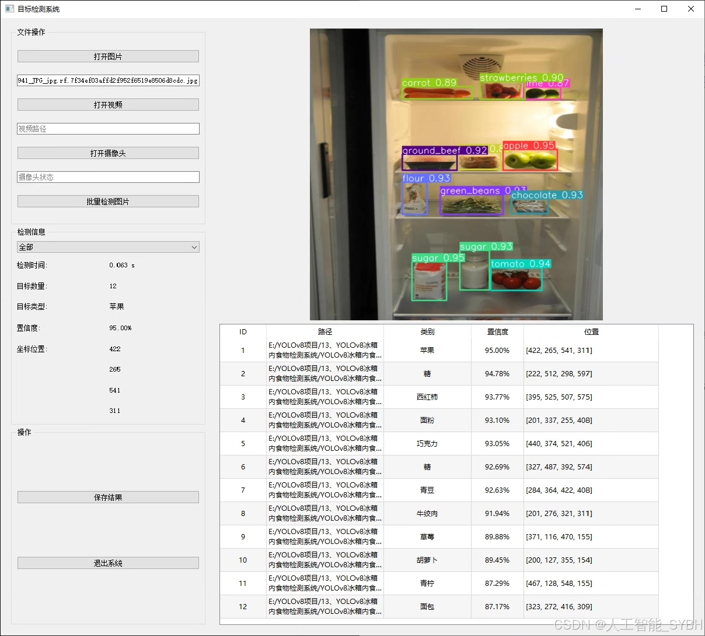
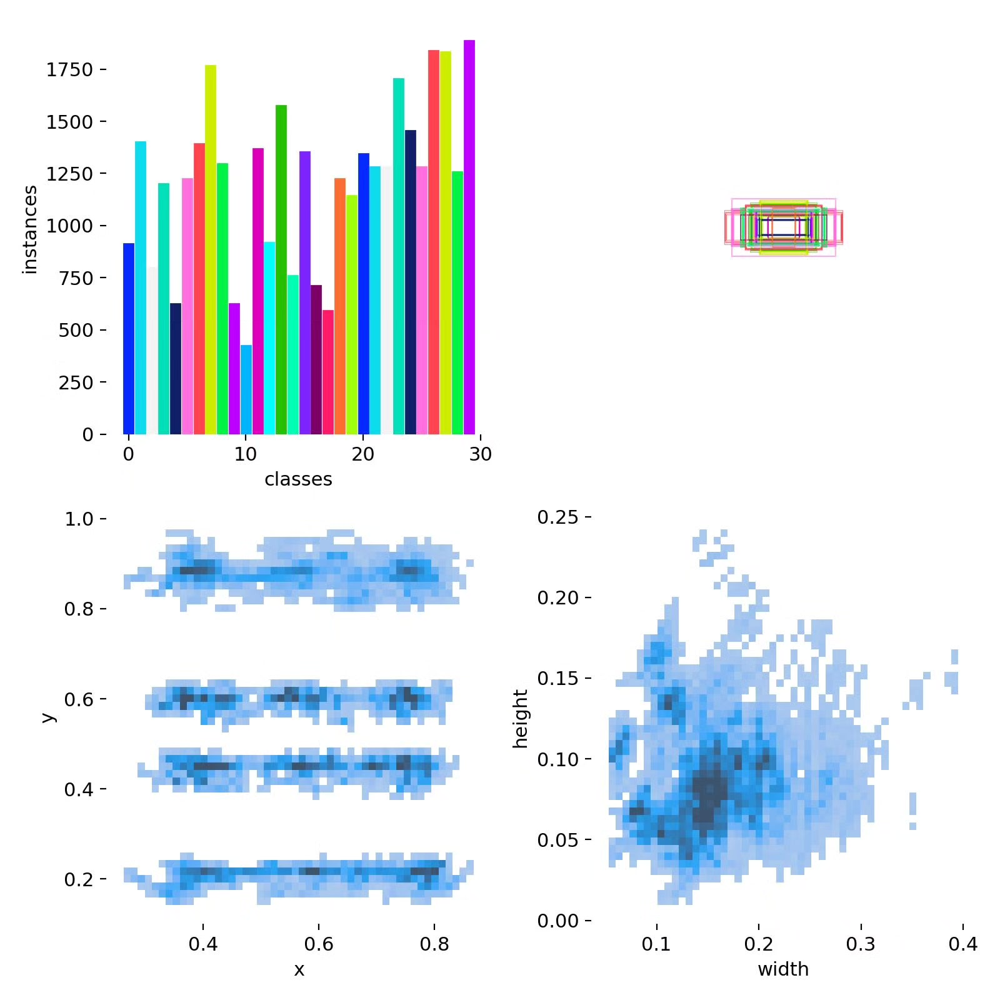
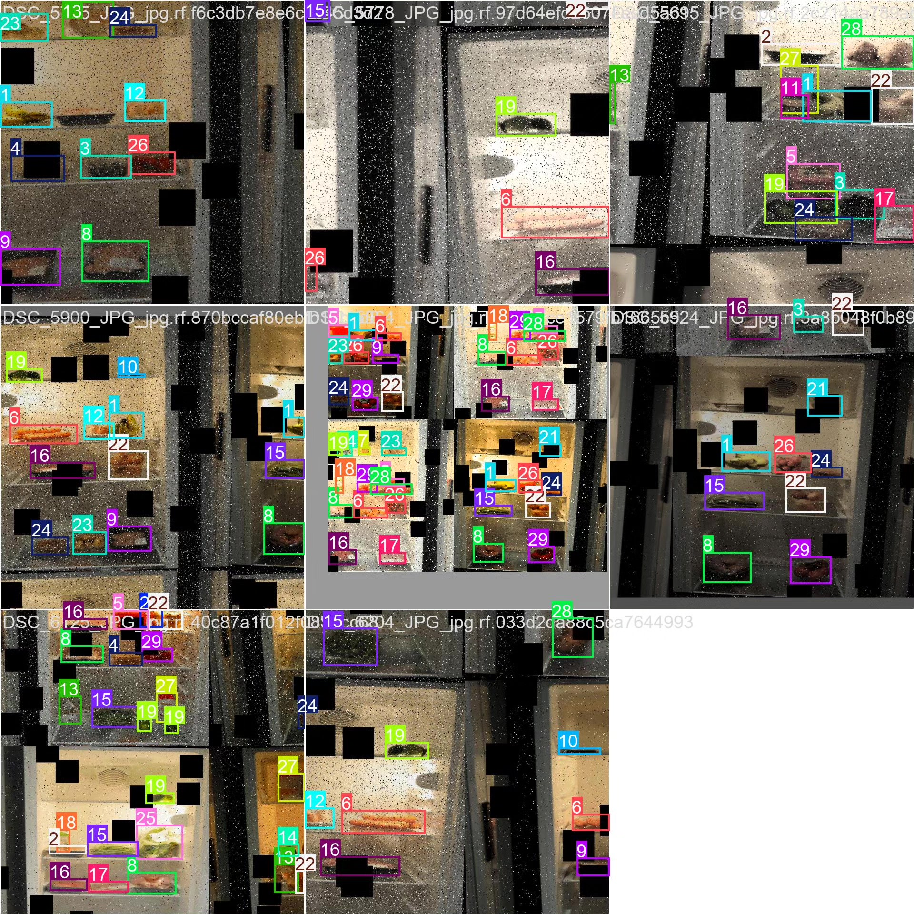
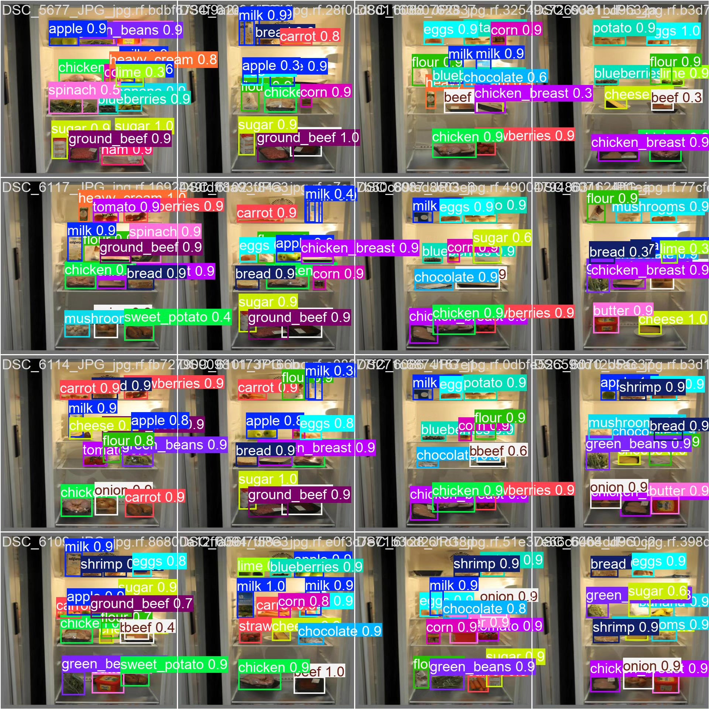

# Based on YOLOv8 deep learning for the detection of internal components in refrigerators (YOLOv8

## Body

This project is based on the advanced YOLOv8 object detection algorithm, developing a smart system specifically for the identification and classification of food components inside refrigerators. The system can accurately recognize and classify 30 common foods, including fruits (such as apples, bananas, strawberries), vegetables (such as carrots, spinach, potatoes), meat (such as beef, chicken, ham), dairy products (such as milk, cheese), and other common ingredients (such as eggs, flour, sugar, etc.). The training of this system uses a dataset containing 3050 high-quality images (2896 training images, 103 validation images, 51 test images), ensuring the robustness and accuracy of the model in various real-world application scenarios.

The company's product has obtained the official commercial license certification from YOLO.

We provide after-sales service.

After payment, we will provide WeChat ID to answer questions at any time.

Environment configuration: We will provide an instructional tutorial on environment configuration, and WeChat will provide答疑.

Remote installation service: If you need remote configuration, an additional fee of 69 is required, with all fees refunded if the configuration fails (only the installation fee is refunded for older computers).

Retraining dataset: After setting up the environment, you can train on your own computer. If you need us to retrain, just pay 69 plus computing power fees (2.5 yuan/hour).

Full after-sales service

## Images

## Payment

Here is a pay link on Stripe ( https://buy.stripe.com/3cs8yP7sY87d0vu9AB ). Please contact me lonlonago@foxmail.com after funding $89, and I will send you a complete data files , thank you!

